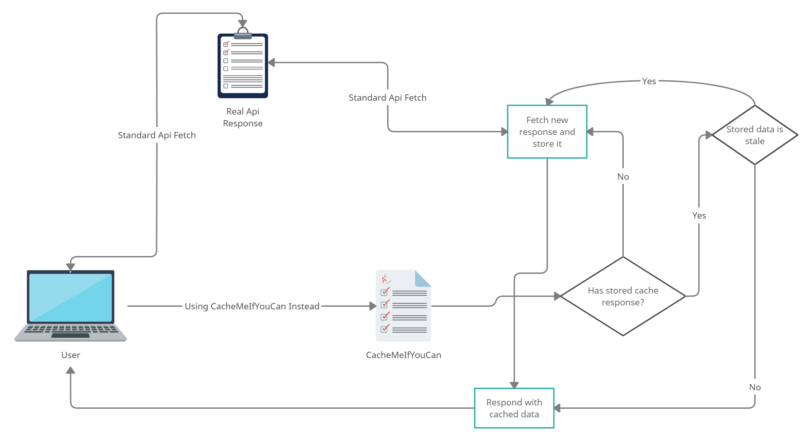

## Quick start

1. Run `npm install`
2. Copy `env.json.example` to `env.json`
3. Fill in the missing fields
4. Create a directory called `cached` inside this directory
5. Run `npm run start` and navigate to `http://localhost:4000`
6. You should see an image similar to the above with logs below it
7. Hitting any api but replacing with `http://localhost:4000/api` will instead redirect the request through `CacheMeIfYouCan` and the response will be stored for subsequent requests
8. Example: the URL `https://api.themoviedb.org/3/movie/76341?api_key=123456789` would become `http://localhost:4000/api/3/movie/76341` (you omit the api key)
9. After the specified time in the `env.json` (on an interval) the cache will be cleared

### Diagram of process

