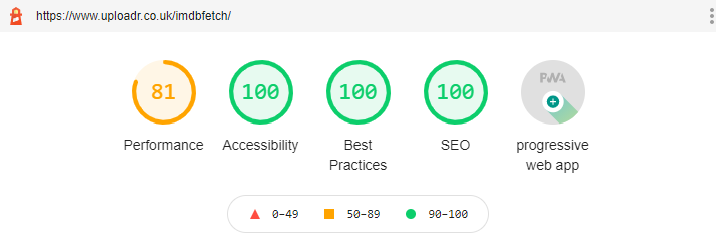
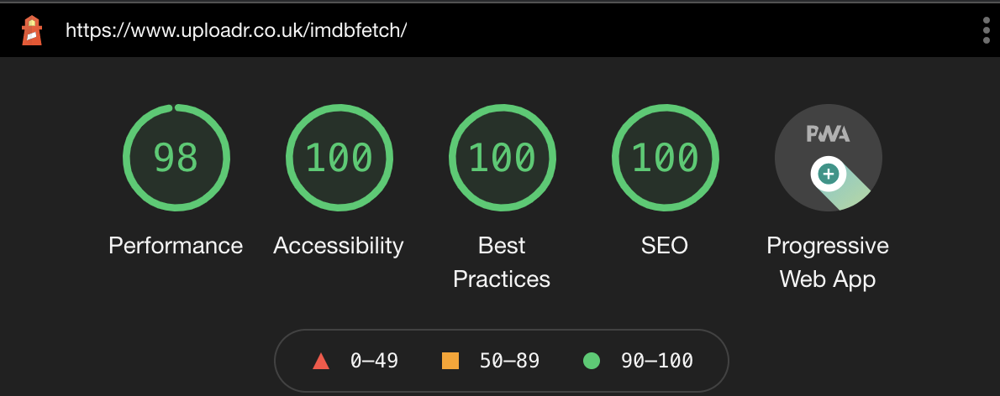

# IMDb Fetcher
## Fetches the 10 highest box office films with trailers and info
### Installable as a PWA
<a href="https://www.uploadr.co.uk/imdbfetch/" target="_blank" rel="noopener">
Click for a live example!
</a>
<br>
<br>


## Current Lighthouse Scores 
### Mobile - incognito



### Desktop - incognito



## Development steps
Development has been greatly simplified
1. If this is the first time using the repo run `npm install`
2. Run `npm run watch:develop` to start local development

### Server Deployment steps
If you wish to run this on your own server copy the repo and do the following:

1. Copy `env.json.example` to `env.json`
2. Add your api key to `env.json`
3. For first time use, run `npm install`
4. For subsequent use, run `npm run fetch`
5. Files then are written to `public/outputs/` once per day (you may need to create this folder)

### Serve html files

6. Html and client side js is stored inside `public`
7. In the local repo you will need to update the url stored in `env.ts`

# Notes about AWS image params

- You can set the desired quality of the images by adding `@._V1_UX1000_CR0,6,1000,1375.jpg` to the end of the request url.
- The parameters appear to be as follows (after randomly testing):
- UX How high res the image should be (assuming dpi)
- CR0,6 appears to control cropping in some way, increasing the second number moves the image down?
- The final two appear to be setting the aspect ratio, I have found best results to be to have the first number match the UX number (otherwise you end up with white where the image does not fit or a cropped image)

# Apache config with React Router

Because react router pushes `/the-new-page` to the end of the URL, if you refresh the link, apache does not know where to send you.

The solution seems to be to get the app to redirect you back to `index.html` always so that the router can take care of it.

The following URLs helped to solve this issue:

[Editing the .htaccess correctly](https://www.andreasreiterer.at/fix-browserrouter-on-apache/)

[Knowing which .conf file to edit](http://smartwebdeveloper.com/ubuntu/httpd-conf-location-on-ubuntu)

Thanks to this the following link should take you to the film ["nobody"](https://www.uploadr.co.uk/imdbfetch/tt7888964)

# Apache CORS Settings

Solved by following: [this guide](https://blog.magepsycho.com/invalid-command-header-perhaps-misspelled-or-defined-by-a-module-not-included-in-the-server-configuration/)

And adding 
```
Header set Access-Control-Allow-Origin "*"
``` 
to the `.conf` and restarting